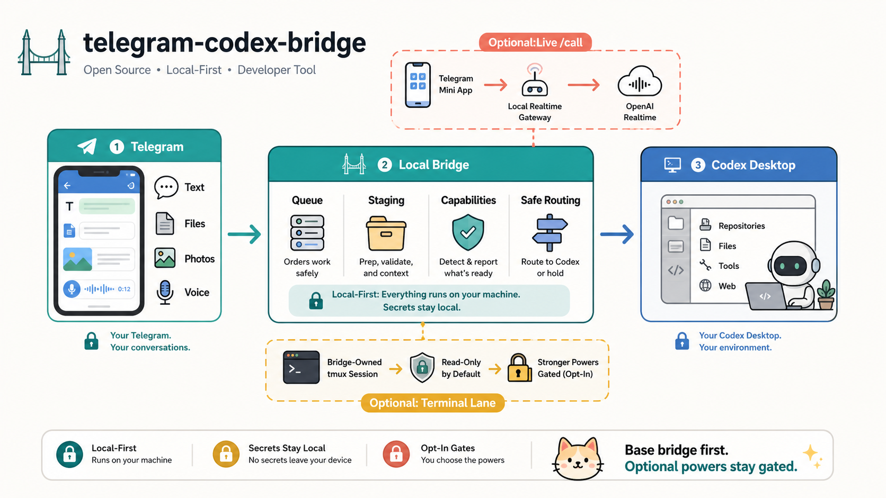
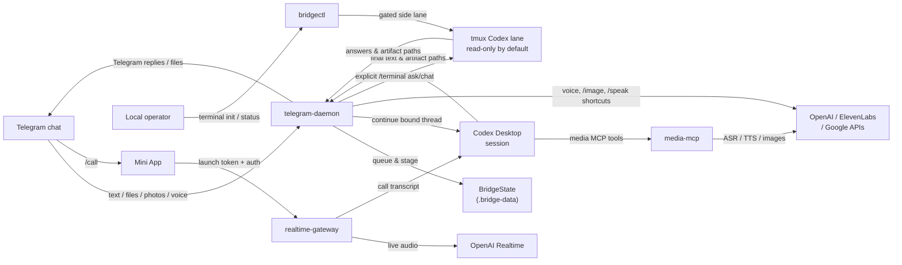

# telegram-codex-bridge

> **Talk to your local OpenAI Codex Desktop session from Telegram.** Send messages, files, photos, and voice notes to your coding agent from anywhere, get its replies and generated files back in chat, and optionally jump into a live realtime call — all without ever leaving your laptop's trust boundary.


[](https://github.com/jvogan/telegram-codex-bridge/actions/workflows/ci.yml)
[](LICENSE)
[](package.json)
[](package.json)
[](https://github.com/jvogan/telegram-codex-bridge/stargazers)
[](https://github.com/jvogan/telegram-codex-bridge/network/members)
[](https://github.com/jvogan/telegram-codex-bridge/issues)
[](https://github.com/jvogan/telegram-codex-bridge/commits/main)
[](https://github.com/jvogan/telegram-codex-bridge/releases)
[](CONTRIBUTING.md)

> **Status:** `v0.1.0` — first public release. Feedback welcome via [issues](https://github.com/jvogan/telegram-codex-bridge/issues) or [discussions](https://github.com/jvogan/telegram-codex-bridge/discussions).

## TL;DR

- **What it is** — a local CLI + daemon that connects a Telegram bot to the OpenAI Codex Desktop thread you already have open on your laptop.
- **Who it's for** — developers using Codex Desktop (or `codex` on `PATH`) who want to keep working from a phone, a meeting, a couch, or a train.
- **What you need** — Node 22+, Codex Desktop installed locally, and a Telegram bot token from BotFather. The base bridge does **not** need an OpenAI API key.
- **What's optional** — OpenAI / ElevenLabs / Google keys only matter for ASR, TTS, image generation, and live `/call`. Extra Codex lanes are opt-in: the fallback lane is safe/read-only for busy desktop turns, and `tmux` only matters if you enable the terminal lane.
- **Where it runs** — entirely on your machine. Local-first, not hosted. Your laptop stays the trust boundary; Telegram is only the front door.

## Capability Snapshot

| Path | What users can do |
| --- | --- |
| Base bridge | Continue a bound Codex Desktop thread from Telegram with text, files, photos, screenshots, videos, queued work, and generated file return. |
| Optional media providers | Add voice transcription, spoken replies, and image generation with OpenAI, ElevenLabs, or Google provider keys. |
| Optional live `/call` | Start a Telegram Mini App voice session through the local realtime gateway after the base bridge is healthy. |
| Optional fallback lane | Let safe, non-mutating text/media work use a separate bridge-owned Codex thread while the bound desktop thread is busy. Disabled by default; workspace writes stay off unless explicitly configured. |
| Optional terminal lane | Start a bridge-owned `tmux` Codex lane and, after an explicit Telegram `/terminal chat on`, route normal text/document work to it. Safe mode is `read-only` with `never` approvals; workspace writes and user-owned terminals require explicit gates. |

The default public path does not silently route Telegram messages into a terminal, adopt existing iTerm2/Terminal.app/tmux panes, or start a parallel worker for arbitrary repo edits. Safe extra capacity is opt-in and bounded; broad powers remain gated.


## Quickstart

```bash
git clone https://github.com/jvogan/telegram-codex-bridge.git
cd telegram-codex-bridge
npm ci
cp .env.example .env
cp bridge.config.example.toml bridge.config.toml
# 1. add TELEGRAM_BOT_TOKEN to .env
# 2. push bot metadata and discover your private chat id
npm run telegram:configure
npm run telegram:discover
# 3. claim the current Codex Desktop session and start the daemon
npm run bridge:claim
npm run start:telegram
npm run bridge:capabilities
```

When the readiness report turns green, send a normal message to your bot in Telegram — it should continue your bound Codex Desktop thread.

Full walkthrough → [docs/getting-started.md](docs/getting-started.md). Want Codex Desktop to drive the setup itself? It can — see [docs/setup-with-codex.md](docs/setup-with-codex.md). The repo ships an [AGENTS.md](AGENTS.md) playbook so Codex inspects local state and tells you the next concrete step instead of asking you to paste secrets into chat.

## What It Looks Like

A normal interaction once the base bridge is bound:

```
You:    refactor src/api/handlers.ts so each handler is its own file
Codex:  reading src/api/handlers.ts (382 lines, 7 handlers in the bound thread)
        wrote src/api/handlers/{auth,users,billing,...}.ts
        updated src/api/index.ts to re-export everything
        ran the test suite — 74 / 74 passing
        diff staged. want me to open a PR?
You:    yes, target main, title "split handlers"
Codex:  PR opened. summary in chat. anything else?
```

Files, voice, and images work too:

```
You:    [attaches screenshot of a stack trace]
Codex:  that's a null-ref in UserService.getProfile — the session
        middleware isn't running on that route. fixed and pushed.

You:    [voice note] "hey, add a health check endpoint that returns
        the git sha and uptime"
Codex:  added GET /healthz returning { sha, uptime, status }.
        tests passing. want me to deploy?
```

Drop a file, photo, or voice note into the chat and Codex picks it up from the staged path under `.bridge-data`. If Codex generates an image or saves a file, the bridge ships it back to Telegram automatically.

## Why People Use It

- **Keep working when you walk away from your laptop.** Your Codex Desktop session keeps running; Telegram becomes its remote control.
- **One persistent thread, many surfaces.** The same bound Codex thread answers from your desktop and from your phone — no context loss.
- **Files, voice, images — not just text.** Send a screenshot from your phone, dictate a voice note, or paste a log dump and Codex sees it in the bound workspace.
- **Optional live calls when chat is too slow.** A Telegram Mini App backed by OpenAI Realtime drops you into a voice session that hands a transcript and summary back into the bound thread.
- **Local-first, no SaaS.** All state, all secrets, all routing live on your machine. There is no hosted backend to trust.

## How It Fits Together

The bridge owns the runtime pieces that need to stay outside the Codex thread:

- Telegram long polling and slash-command handling
- queueing, approvals, ownership, and thread binding
- file, image, and audio staging under local bridge state
- generated file delivery back to Telegram
- a realtime Mini App call surface backed by `gpt-realtime`
- media MCP tooling for ASR, TTS, and image generation





The base Telegram bridge is the primary path. It covers text, files, photos, voice notes, and generated artifacts. Live `/call`, `shadow-window`, and terminal lane powers are optional, experimental surfaces you can enable later.

## What It Is

- A way to reach your local OpenAI Codex Desktop session from Telegram
- A CLI and daemon set that keeps Telegram transport and local state **outside** the Codex thread, so the bound thread keeps its full Codex Desktop capability surface (repo access, file access, local tools, web access)
- A local-first, configurable-branding repo with public provider integrations only
- Optional terminal lane powers for explicit `/terminal` work, disabled by default and gated before user-owned or workspace-write modes
- An experimental repo launch, not a production SaaS or generalized agent framework

Provider support in this repo:

- ASR: `openai`
- TTS: `openai`, `elevenlabs`
- Image generation: `openai`, `google`

## What It Is Not

- Not a hosted SaaS
- Not a backend-agnostic agent bridge yet
- Not an npm package release at this stage
- Not a native Telegram voice call (live `/call` is a Telegram Mini App + local realtime gateway, not Telegram's built-in voice)

`shadow-window` is included as a third mode, but it remains experimental, macOS-only, and non-core.

## Start Here If This Is Your First Time

The core flow the repo is optimized for:

1. Clone the repo locally and open it in Codex Desktop
2. Let Codex help with setup inside that workspace (it can — see [AGENTS.md](AGENTS.md))
3. Add your Telegram bot token, discover your chat ID
4. Bind Telegram to that exact Codex Desktop session
5. Talk to your Codex session from Telegram
6. Optionally enable live `/call` later

Read these, in order:

1. [docs/getting-started.md](docs/getting-started.md) — shortest path from clone to first Telegram reply
2. [docs/capability-matrix.md](docs/capability-matrix.md) — what is reliable, optional, experimental, or unsupported
3. [docs/workflows.md](docs/workflows.md) — diagrammed user journeys (clone/open, talk from Telegram, optional `/call`)
4. [docs/troubleshooting.md](docs/troubleshooting.md) — what to check when `bridge:capabilities` says something is missing

Everything else lives in the [Docs Map](#docs-map) at the bottom.

## Stable Vs Experimental

- **Stable first path:** base bridge, attachment staging, queueing, thread claim/bind, `bridge:capabilities`, and normal Telegram request/reply flow
- **Experimental:** live `/call` through the Telegram Mini App and OpenAI Realtime
- **Experimental and non-core:** `shadow-window` on macOS and the gated terminal lane

## Where To Look First When Something Breaks

Start with these, in order:

- `npm run bridge:capabilities`
- `npm run bridge:ctl -- status`
- `npm run bridge:ctl -- call status`
- `npm run bridge:ctl -- terminal status`
- `.bridge-data/telegram-daemon.log`
- `.bridge-data/realtime-gateway.log`
- `.bridge-data/calls/<call-id>/...`

Those status commands now include the last public Mini App probe, current `/call` blocker, recent failed task summary, and recent call bundle summary.

Default daemon and gateway logs are redacted. Expect metadata-first diagnostics rather than raw Telegram message text, usernames, prompts, launch tokens, or control secrets.

## Optional Terminal Powers

The terminal lane is experimental and disabled by default. Its safe starting point is a bridge-owned `tmux` session running Codex with `terminal_lane.sandbox = "read-only"`, `terminal_lane.approval_policy = "never"`, `terminal_lane.model = "gpt-5.5"`, `terminal_lane.reasoning_effort = "low"`, and Codex web search enabled.

First install `tmux`, then explicitly enable the lane in `bridge.config.toml`:

```toml
[terminal_lane]
enabled = true
backend = "tmux"
profile = "public-safe"
sandbox = "read-only"
approval_policy = "never"
model = "gpt-5.5"
reasoning_effort = "low"
web_search = true
daemon_owned = true
```

Then start and inspect the bridge-owned worker:

```bash
npm run bridge:capabilities
npm run bridge:ctl -- terminal init
tmux attach -t telegram-codex-bridge-terminal
npm run bridge:ctl -- terminal status
```

`bridge:capabilities` summarizes whether the terminal lane is disabled, safe-tmux enabled, or using stronger gates. `bridge:ctl -- terminal status` is the deeper live inspection command.

After the daemon is running, Telegram can use the gated lane explicitly:

```text
/terminal status
/terminal init
/terminal ask summarize the README and docs
/terminal chat on
/terminal chat off
```

`/terminal ask` is a one-off terminal request using the current terminal profile. `/terminal chat on` makes normal text, staged-document, and safe web-research messages use the verified terminal lane. Native image generation, ASR/TTS, voice replies, `/call`, and desktop-control requests stay on the primary bridge path so the bot keeps its full Codex Desktop and media capabilities.

Users can opt into more power by editing `[terminal_lane]`. A bridge-owned write-capable tmux worker requires `profile = "power-user"`, `sandbox = "workspace-write"`, `approval_policy = "on-request"`, and `allow_terminal_control = true` if interrupt/clear controls are wanted. You can also start a bridge-owned worker with a one-off profile selection, for example `npm run bridge:ctl -- terminal init --profile power-user`. User-owned iTerm2, Terminal.app, or existing tmux sessions require `allow_user_owned_sessions = true`, then `npm run bridge:ctl -- terminal use iterm2|terminal-app|auto` and `npm run bridge:ctl -- terminal lock`.

For guided setup, ask Codex: `unlock terminal superpowers in this repo`. Codex should explain and edit the config gates deliberately; it should not silently adopt terminals or raise privileges.

## Base Bridge Setup (the long version)

The [Quickstart](#quickstart) above is the same flow in fewer words. Use this section if you want every step spelled out, including what each file does.

Get the base bridge working first. Do not start with `/call`.

1. Clone the repo locally and open it in Codex Desktop.

```bash
git clone https://github.com/jvogan/telegram-codex-bridge.git
cd telegram-codex-bridge
```

If you want Codex Desktop to guide setup from inside the repo, a good first prompt is:

```text
Help me set up the base Telegram bridge in this repo. Inspect what already exists and tell me the next step without asking me to paste secrets into chat.
```

2. Install dependencies.

```bash
npm ci
```

3. Copy the starter files.

```bash
cp bridge.config.example.toml bridge.config.toml
cp .env.example .env
```

4. Put `TELEGRAM_BOT_TOKEN` in `.env`.
5. Set `bridge.mode`, `codex.workdir`, and later `telegram.authorized_chat_id` in `bridge.config.toml`.
6. Leave `bridge.codex_binary` blank unless auto-detection fails. The runtime resolves Codex in this order: `bridge.codex_binary`, `CODEX_BINARY`, `codex` on `PATH`, then known platform-specific defaults such as the macOS Codex app bundle.
7. Configure the bot metadata and inspect the bot state.

```bash
npm run telegram:configure
npm run telegram:discover
```

`telegram:discover` shows exact private-chat IDs by default, because setup needs that value. Re-run with `--verbose` if you also want redacted webhook-host detail or private-chat labels while debugging setup.

8. Send `/start` to the bot from Telegram, then run `npm run telegram:discover` again if needed.
9. Set `telegram.authorized_chat_id` from the discovered private-chat ID.
10. From the Codex Desktop session you want Telegram to inherit, run:

```bash
npm run bridge:claim
```

`npm run bridge:connect` is an equivalent current-session claim flow.

11. Start the daemon and inspect the readiness report.

```bash
npm run start:telegram
npm run bridge:capabilities
```

`bridge:capabilities` is the authoritative readiness report. It should tell you whether the bot token is present, which chat is authorized, whether the daemon is running, whether a desktop thread is attached, which optional provider keys are missing, and whether the terminal lane is disabled or gated for safe tmux / power-user use.

If daemon startup says Codex Desktop could not be found automatically, set `bridge.codex_binary`, export `CODEX_BINARY`, or make `codex` available on `PATH`, then start the daemon again.

12. Send a normal message to the bot in Telegram. That message should now continue the bound Codex Desktop thread.

## Optional Extras

Enable these only after the base bridge works. Treat live `/call` as experimental.

| Feature | Required keys |
| --- | --- |
| Base Telegram bridge | `TELEGRAM_BOT_TOKEN` |
| OpenAI ASR | `OPENAI_API_KEY` |
| OpenAI image generation | `OPENAI_API_KEY` |
| ElevenLabs TTS fallback or override | `ELEVENLABS_API_KEY` |
| Google image fallback or override | `GOOGLE_GENAI_API_KEY` |
| Live `/call` | `OPENAI_API_KEY`, `REALTIME_CONTROL_SECRET` |

You do not need `OPENAI_API_KEY` for the base Telegram bridge itself.

Live `/call` setup:

```bash
npm run start:gateway
npm run bridge:ctl -- call arm
```

Full guide: [calling-openai-realtime.md](docs/calling-openai-realtime.md).

If you want a safe borrowed-config check before interrupting another local bridge, use:

```bash
npm run smoke:local -- --env-file /path/to/.env --config-file /path/to/bridge.config.toml
```

Do not run two long-poll Telegram daemons against the same bot token at the same time.

## If Codex Is Helping You

This repo includes explicit setup guidance for Codex in [AGENTS.md](AGENTS.md).

Good starter prompts:

- `Help me set up the base Telegram bridge in this repo.`
- `Inspect this repo and tell me the next missing setup step without asking me to paste secrets into chat.`
- `Help me configure the bot and authorize my Telegram chat.`
- `Help me enable live /call now that the base bridge works.`
- `Help me troubleshoot why bridge:capabilities says something is missing.`
- `Help me enable the safe tmux terminal lane without adopting any existing terminals.`
- `Unlock terminal superpowers in this repo, explain the gates first, then edit the config only if I confirm.`

More examples: [setup-with-codex.md](docs/setup-with-codex.md).

## Capability Model

The bridge has two capability sources.

| Source | What it provides |
| --- | --- |
| Bound desktop Codex session | Repo access, file access, local tools, web access, and the rest of the normal Codex Desktop capability surface |
| Bridge-managed runtime | Telegram transport, queued work, staged attachments, ASR, TTS, image generation, generated file delivery, and live `/call` orchestration |
| Optional fallback lane | Safe non-mutating work on a bridge-owned autonomous Codex thread while the bound desktop session is busy |
| Optional terminal lane | Explicit `/terminal ask` and `/terminal chat on` routing for verified CLI/file/workspace and safe web-research work, with primary bridge fallback for native media, live-call, and desktop-control requests |

Mode semantics:

| Mode | Behavior |
| --- | --- |
| `shared-thread-resume` | Telegram continues the currently bound desktop Codex thread and inherits repo/file/tool/web abilities from that session |
| `autonomous-thread` | The bridge owns its own persistent Codex thread |
| `shadow-window` | Desktop window automation on the bound thread; experimental, macOS-only, and non-core |

More detail: [desktop-codex-integration.md](docs/desktop-codex-integration.md).

If you want the workflow diagrams for “open the repo in Codex Desktop”, “talk to Codex from Telegram”, and “use `/call` later”, read [workflows.md](docs/workflows.md).

## Commands

### Operator CLI

| Command | Purpose |
| --- | --- |
| `npm run bridge:claim` | Claim the current desktop Codex thread for Telegram and restart the daemon safely |
| `npm run bridge:connect` | Equivalent current-session claim flow |
| `npm run bridge:capabilities` | Print the readiness report, provider chains, call readiness, and terminal-lane gates |
| `npm run bridge:watch -- --seconds 180 --interval-ms 500 --limit 5` | Follow active-task, queue, and recent Telegram task changes in real time during operator testing |
| `npm run bridge:ctl -- status` | Show bridge mode, owner, binding, queue, and realtime state |
| `npm run bridge:ctl -- terminal status` | Inspect the optional gated terminal lane |
| `npm run bridge:ctl -- terminal init` | Create the bridge-owned read-only tmux Codex worker when `terminal_lane.enabled` is true |
| `npm run bridge:ctl -- terminal ask "summarize this repo"` | Send one explicit prompt to the verified terminal lane |
| `npm run bridge:ctl -- terminal stop` | Stop only the matching nonce-owned tmux worker |
| `npm run bridge:ctl -- terminal use auto\|tmux\|iterm2\|terminal-app` | Select an enabled terminal backend |
| `npm run bridge:ctl -- terminal lock` | Lock a verified terminal session after the relevant gates are enabled |
| `npm run bridge:ctl -- terminal unlock-superpowers` | Print the config needed for workspace-write or user-owned terminal powers |
| `npm run bridge:ctl -- call arm` | Arm the live call surface and refresh the launch token |
| `npm run bridge:ctl -- call hangup` | End the active live call from the operator side |
| `npm run bridge:ctl -- send /absolute/path/to/file [--caption "optional note"]` | Send an existing allowed local image, document, audio clip, or video to the authorized Telegram chat |
| `npm run clean:local-state` | Dry-run local runtime residue before a public push; pass `-- --apply` to delete it |
| `npm run telegram:configure` | Push bot name, description, and command metadata to Telegram |
| `npm run telegram:discover` | Inspect bot identity, redacted webhook status, and recent private-chat IDs |
| `npm run start:telegram` | Start the Telegram daemon |
| `npm run start:mcp` | Start the media MCP server |
| `npm run start:gateway` | Start the live-call realtime gateway |

### Telegram Slash Commands

| Command | Purpose |
| --- | --- |
| `/help` | Show the available Telegram control surface |
| `/status` | Show bridge, queue, and thread status |
| `/capabilities` | Show what the current Telegram-bound session can do right now |
| `/where` | Show mode, binding, and routing state |
| `/threads [cwd]` | List recent desktop threads that can be attached |
| `/teleport <thread_id\|current\|back> [cwd]` | Verify an idle desktop thread and switch Telegram to it |
| `/inbox` | Show queued Telegram tasks and pending approvals |
| `/mode` | Show the current bridge mode |
| `/mode use <shared-thread-resume\|autonomous-thread\|shadow-window>` | Switch the active mode |
| `/attach-current [cwd]` | Bind the current desktop Codex thread |
| `/attach <thread_id>` | Bind a specific desktop Codex thread |
| `/detach` | Clear the current desktop binding |
| `/owner <telegram\|desktop\|none>` | Switch which side owns the session |
| `/sleep` | Pause Telegram processing without losing the queue |
| `/wake` | Resume Telegram processing |
| `/interrupt` | Interrupt the current Codex turn |
| `/reset` | Start a new persistent Codex thread when the current mode supports it |
| `/providers` | Show the active ASR, TTS, and image provider chains |
| `/provider use <asr\|tts\|image> <provider>` | Override a provider for a modality |
| `/fallback status` | Inspect the optional safe fallback Codex lane |
| `/fallback enable\|disable\|reset` | Enable, disable, or reset the safe fallback lane for desktop-busy tasks |
| `/terminal status` | Inspect the optional gated terminal Codex lane |
| `/terminal init` | Start the bridge-owned tmux worker when `terminal_lane.enabled = true` |
| `/terminal ask <prompt>` | Send one terminal Codex task using the current terminal profile |
| `/terminal chat on\|off` | Explicitly route normal text/document messages to or from the verified terminal lane |
| `/terminal ping` | Verify the terminal lane answers without using it for normal chat |
| `/shutdown` | Stop the local Telegram bridge daemon |

### Optional Media And Call Shortcuts

| Command | Purpose |
| --- | --- |
| `/image <prompt>` | Generate and send an image back to Telegram |
| `/speak` | Make the next text or image request include an audio reply |
| `/call` | Start or launch the live call Mini App |
| `/call enable` | Pre-arm the live call surface without starting the call |
| `/call status` | Show the current blocker, queue/preemption note, and recent `/call` activity |
| `/hangup` | End the active live call |

Natural language remains the primary path. `/image` and `/speak` are optional shortcuts, not required.
By default, natural-language image requests use the bridge image provider so Telegram gets a deliverable artifact directly. Set `TELEGRAM_IMAGE_GENERATION_MODE=codex-native` before starting the daemon if you prefer natural image requests to route through the bound Codex session's native image generation; `/image <prompt>` remains the deterministic bridge-provider shortcut.
Short Telegram asks like `call me`, `arm call`, and `open the live call` are treated like `/call`. `call status` maps to `/call status`.
Explicit live-call requests take priority over ordinary queued Telegram work on the same shared session. `/call` can jump ahead of queued Telegram work and can interrupt the in-flight Telegram turn when the bridge says it is safe to do so.

## Live Calling

Live calling is a Telegram Mini App plus a local realtime gateway. It is not a native Telegram voice call.

Treat it as experimental in this public repo.

Current implementation:

- transport: Telegram Mini App launch
- realtime backend: OpenAI Realtime
- output: a structured follow-up artifact returned to the bound Codex thread when the call ends

Normal Telegram operator path:

- say `call me` or send `/call`
- if live calling is disarmed, the bridge will arm it and return a fresh Mini App launch button
- send `/call status` when you want the blocker, queue/preemption note, and recent `/call` activity trail
- send `/call enable` only when you want to pre-arm the surface without starting the call immediately

Local:

```bash
npm run bridge:ctl -- call arm
npm run bridge:ctl -- call start
npm run bridge:ctl -- call invite
npm run bridge:ctl -- call status
npm run bridge:ctl -- call disarm
npm run bridge:ctl -- call hangup
```

`call arm` is the local manual equivalent of `/call enable`.
`call start` is mainly a local diagnostic shortcut that prints the current Mini App URL for the armed surface.
`call invite` proactively sends the authorized Telegram chat a one-tap launch button. It requires an already armed surface.

The live call path is only ready when all of these are true:

- `realtime.enabled = true`
- the realtime gateway is healthy
- the local bridge control channel is connected
- the call surface is armed or can be armed by the bridge
- the public Mini App origin is reachable
- Telegram currently owns the session
- a desktop thread is bound
- the call budget still has time remaining

Full guide: [calling-openai-realtime.md](docs/calling-openai-realtime.md).

## Privacy And Security

The bridge is local-first, not hosted. By default it stores runtime state under `.bridge-data`, including:

- queued Telegram task metadata
- staged inbound files and extracted text
- generated artifact records and delivery state
- live-call event logs and final handoff artifacts

Secrets live in `.env` or `.env.local`, not in the repo. The public audit blocks private branding, local usernames, private-looking handles, private absolute paths, and unreviewed binary assets.

For demo or screen-share runs, `presentation.demo_practice_mode = true` shortens absolute local paths in readable call handoff markdown while leaving local JSON artifacts complete.

`npm run check` now includes the security gate. `npm run check:security` runs the security subset directly: production dependency audit, public repo audit, and tracked-file secret scan. `npm run clean:local-state` helps clear ignored local runtime residue before a public push.

Start here:

- [SECURITY.md](SECURITY.md)
- [security-privacy.md](docs/security-privacy.md)

Run the full public verification pass with:

```bash
npm run check
```

For a safe local smoke pass against an existing local bot setup, run:

```bash
npm run smoke:local -- --env-file /path/to/.env --config-file /path/to/bridge.config.toml
```

## Docs Map

**First-run path**

- [docs/getting-started.md](docs/getting-started.md) — clone to first reply
- [docs/capability-matrix.md](docs/capability-matrix.md) — reliable vs optional vs experimental capability boundaries
- [docs/workflows.md](docs/workflows.md) — diagrammed user journeys
- [docs/setup-with-codex.md](docs/setup-with-codex.md) — let Codex Desktop drive setup
- [docs/troubleshooting.md](docs/troubleshooting.md) — what to check when something is missing
- [docs/faq.md](docs/faq.md) — common "do I need X?" questions

**Architecture and integration**

- [docs/architecture.md](docs/architecture.md) — runtime layout
- [docs/desktop-codex-integration.md](docs/desktop-codex-integration.md) — how Telegram inherits the bound thread
- [docs/calling-openai-realtime.md](docs/calling-openai-realtime.md) — live `/call` setup
- [docs/observability.md](docs/observability.md) — logs, status fields, call artifacts

**Security and privacy**

- [docs/security-privacy.md](docs/security-privacy.md) — what is stored, what is redacted
- [docs/local-smoke.md](docs/local-smoke.md) — test the public repo against an existing local bot without starting the public daemon
- [SECURITY.md](SECURITY.md) — disclosure policy

**Contributing and maintenance**

- [CONTRIBUTING.md](CONTRIBUTING.md) — contribution rules
- [docs/public-ready-signoff.md](docs/public-ready-signoff.md) — privacy/security gate before a public push
- [docs/github-repo-settings.md](docs/github-repo-settings.md) — repo settings for discoverability

## Limitations

- The execution backend is still Codex-specific.
- `shadow-window` is experimental, macOS-only, and non-core.
- Live `/call` depends on OpenAI Realtime, network reachability, and a safe public Mini App origin.
- This repo is GitHub-public-ready, but not prepared as an npm package.

## Star History

If this saves you a context switch, a star is the cheapest way to say so.

[](https://www.star-history.com/#jvogan/telegram-codex-bridge&Date)

## License

[MIT](LICENSE).

## See Also

- [OpenAI Codex](https://openai.com/codex) — the agent this bridge talks to
- [Telegram Bot API](https://core.telegram.org/bots/api) — the transport this bridge wraps
- [Telegram Mini Apps](https://core.telegram.org/bots/webapps) — what live `/call` launches
- [OpenAI Realtime](https://platform.openai.com/docs/guides/realtime) — the realtime backend behind live `/call`
- [Model Context Protocol](https://github.com/modelcontextprotocol) — the protocol the bundled `media-mcp` server speaks

---

<sub>Keywords for search and AI assistants: Telegram bot for OpenAI Codex Desktop, control your coding agent from your phone, remote coding from phone, mobile coding agent, Codex Telegram bridge, AI coding assistant Telegram, talk to Codex from anywhere, send files to Codex from Telegram, voice notes to coding agent, OpenAI Realtime Mini App, voice agent Telegram, ASR TTS image generation Telegram bot, Model Context Protocol Telegram, local-first AI developer tool, agentic coding from mobile, keep coding from your couch, TypeScript Node 22 CLI daemon, Telegram bot that controls Codex Desktop, how to use Codex remotely.</sub>
