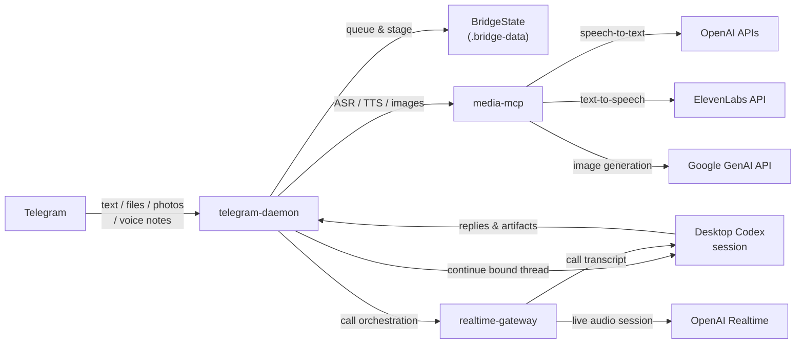
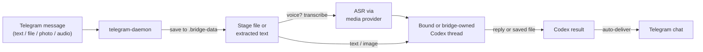
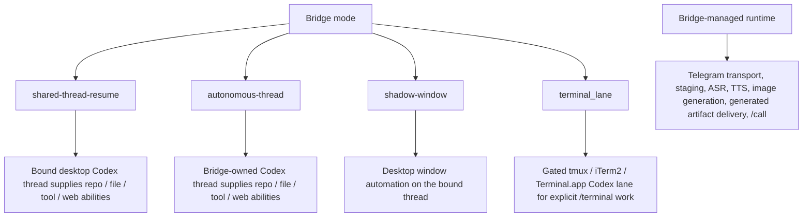
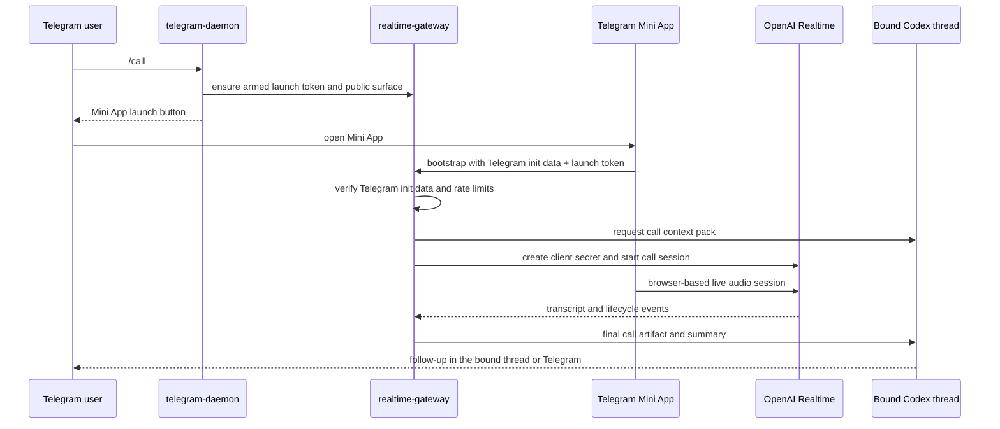

# Architecture

`telegram-codex-bridge` is a local runtime that binds Telegram to a Codex Desktop session while keeping transport, queueing, staged files, and live-call orchestration outside the Codex thread itself.

## Component Architecture

### Runtime responsibilities

- `bridgectl`
  - operator CLI for start/stop/status, safe binding changes, live-call control, and optional terminal lane control
- `telegram-daemon`
  - Telegram transport, queue worker, staged attachment handling, provider overrides, and generated artifact delivery
- `realtime-gateway`
  - Mini App launch surface, Telegram init-data verification, call bootstrap, websocket coordination, and final handoff artifacts
- `media-mcp`
  - ASR, TTS, and image-generation tools exposed through MCP
- `BridgeState`
  - local state for queueing, approvals, binding, provider overrides, call surface state, and artifact metadata

## Telegram Task Flow

Key behavior:

- photos become local image inputs for Codex
- text-like files are inlined when possible
- PDFs and richer documents get best-effort text extraction when supported by host tools
- generated PDFs, reports, spreadsheets, markdown files, and text files can be sent back automatically if the Codex response names the saved path

## Capability Inheritance Model

Mode wording should stay consistent everywhere:

- `shared-thread-resume`: Telegram continues the currently bound desktop Codex thread and inherits repo/file/tool/web abilities from that session
- `autonomous-thread`: the bridge owns its own persistent Codex thread
- `shadow-window`: experimental, macOS-only, and non-core
- `terminal_lane`: experimental, disabled by default, explicit via `/terminal`, gated before workspace-write or user-owned sessions, and primary-bridge fallback for native media/call/desktop requests

## Live `/call` Flow

## Internal Gateway Routes

These routes are internal implementation details. They are documented for operators and contributors, not as a stable public API:

- `GET /healthz`
- `GET /miniapp`
- `POST /api/call/bootstrap`
- `POST /api/call/hangup`
- `POST /api/call/finalize`
- `WS /ws/call`
- `WS /ws/bridge`
