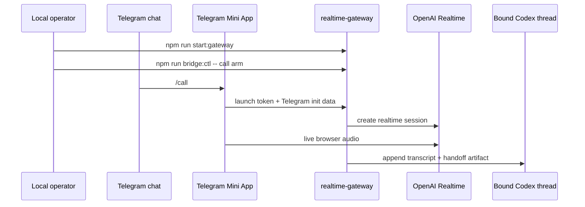

# Live Calling With OpenAI Realtime

Live `/call` uses a Telegram Mini App plus the local `realtime-gateway`. It is not a native Telegram voice call.

Do not start here. Get the base Telegram bridge working first, then come back to this page.

Current implementation:

- launch surface: Telegram Mini App
- realtime backend: OpenAI Realtime
- follow-up: a structured handoff artifact returned to the bound Codex thread when the call ends

Future backend abstraction is out of scope for this repo campaign. The public docs should describe the current OpenAI-backed behavior directly.

## Call Workflow



The important user-facing point is that `/call` still talks to the same bound Codex workflow. It just does it through a live Mini App plus OpenAI Realtime instead of normal Telegram messages.

## Required Secrets

These environment variables are required for live calling:

- `TELEGRAM_BOT_TOKEN`
- `OPENAI_API_KEY`
- `REALTIME_CONTROL_SECRET`

Optional for non-calling media features:

- `ELEVENLABS_API_KEY`
- `GOOGLE_GENAI_API_KEY`

## Required Config Surface

At minimum, configure these keys in `bridge.config.toml`:

- `realtime.enabled = true`
- `realtime.bridge_id`
- `realtime.tunnel_mode`
- `realtime.gateway_host`
- `realtime.gateway_port`
- `realtime.model`
- `realtime.transcription_model`
- `realtime.voice`
- `realtime.max_call_ms`
- `realtime.max_daily_call_ms`

Important operational keys:

- `realtime.public_url`
- `realtime.control_url`
- `realtime.launch_token_ttl_ms`
- `realtime.bootstrap_rate_limit_per_ip`
- `realtime.bootstrap_rate_limit_per_bridge`
- `realtime.bootstrap_rate_limit_per_user`

Optional presentation key:

- `presentation.demo_practice_mode` shortens absolute local paths in readable call handoff markdown. The JSON handoff stays complete for local automation.

## Tunnel Modes

### Managed quick tunnel

Use `realtime.tunnel_mode = "managed-quick-cloudflared"` when you want the bridge to bring up a short-lived public origin automatically. In this mode:

- keep `realtime.public_url = ""`
- keep `realtime.control_url = ""` unless you deliberately override the local bridge-control path
- make sure `cloudflared` is installed and reachable as `realtime.tunnel_bin`

### Static public URL

Use `realtime.tunnel_mode = "static-public-url"` when you already operate a stable public origin. In this mode:

- set `realtime.public_url` to the externally reachable Mini App origin
- optionally set `realtime.control_url` if the bridge control websocket should not use the default local path
- make sure the public origin can reach the realtime gateway cleanly

## Operator Flow

Before you start, `npm run bridge:capabilities` should already show:

- `TELEGRAM_BOT_TOKEN: present`
- `Authorized chat: ...`
- `Telegram daemon: running`
- `Desktop thread binding: ready` when using `shared-thread-resume`
- `OPENAI_API_KEY: present`
- `REALTIME_CONTROL_SECRET: present`

1. Start the realtime gateway.

```bash
npm run start:gateway
```

2. Confirm bridge status.

```bash
npm run bridge:ctl -- status
npm run bridge:capabilities
```

3. Arm the call surface.

```bash
npm run bridge:ctl -- call arm
npm run bridge:ctl -- call status
```

4. Launch the call from Telegram with `/call`.
5. End it from Telegram with `/hangup` or from the operator side with:

```bash
npm run bridge:ctl -- call hangup
```

## `/call` Readiness Prerequisites

`/call` is only ready when all of these are true:

- `realtime.enabled = true`
- the realtime gateway is healthy
- the local bridge control channel is connected
- the call surface is armed
- the public Mini App origin is reachable
- Telegram currently owns the session
- a desktop thread is bound
- the call budget still has time remaining

If one of those checks fails, `bridge:capabilities`, `/capabilities`, and `/call status` are the fastest ways to see why.

## Cost And Budget Controls

The public config exposes explicit call caps:

- `realtime.max_call_ms`
- `realtime.max_daily_call_ms`
- `realtime.idle_warning_ms`
- `realtime.idle_timeout_ms`
- `realtime.auto_disarm_idle_ms`

Use them aggressively. Live calling is the most network-exposed and potentially expensive feature in the repo.

## Failure Modes To Expect

- public Mini App origin unreachable
- bridge control channel not connected
- missing `REALTIME_CONTROL_SECRET`
- missing `OPENAI_API_KEY`
- stale or expired launch token
- Telegram user failed Mini App auth verification
- bootstrap rate limits exceeded
- another live call is already active or being prepared
- call budget exhausted

## Internal Routes

These routes exist to support the current implementation, but they are not a stable external API contract:

- `GET /healthz`
- `GET /miniapp`
- `POST /api/call/bootstrap`
- `POST /api/call/hangup`
- `POST /api/call/finalize`
- `WS /ws/call`
- `WS /ws/bridge`
