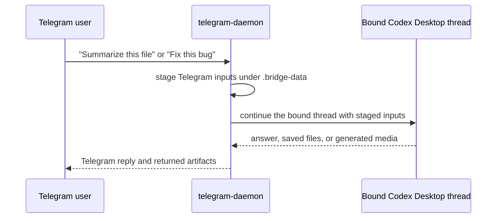

# Desktop Codex Integration

This repo is aimed at Codex Desktop users first. The core question is: how does Telegram get access to local repo/file/tool/web abilities without turning the Telegram bot itself into a privileged agent runtime?

The answer is that Telegram does not own those abilities directly. The bridge binds Telegram to a Codex thread and lets the bound thread keep its normal Codex Desktop capability surface.

## Mental Model

- The bound desktop Codex session supplies repo access, file access, local tools, and web access.
- The bridge runtime supplies Telegram transport, staged attachments, media providers, generated artifact delivery, and live `/call`.
- The optional terminal lane is explicit in the public repo; it does not replace the bound desktop thread. `/terminal ask` and `/terminal chat on` can use a verified lane for text/document work, while native media, web-search, live-call, and desktop-control requests stay on the primary bridge path. Stronger terminal powers are config-gated.
- `bridge:capabilities` is the authoritative report for what is ready right now, including bot-token presence, authorized chat, daemon state, desktop binding, optional provider readiness, live-call readiness, and terminal-lane gates.

## Talking To Codex Through Telegram



This is the main product experience. Telegram is not running its own privileged agent runtime. It is routing work into the Codex Desktop session you explicitly bound.

## Binding Model

Use one of these from the Codex Desktop session you want Telegram to inherit:

```bash
npm run bridge:claim
npm run bridge:connect
```

Both entry points resolve the current desktop thread, bind it, set Telegram as the owner, and restart the daemon safely.

If you need to rebind from inside Telegram, use:

- `/threads [cwd]`
- `/teleport <thread_id|current|back> [cwd]`
- `/attach-current [cwd]`
- `/attach <thread_id>`
- `/detach`
- `/owner <telegram|desktop|none>`

## Mode Semantics

| Mode | What supplies repo/file/tool/web ability | When to use it |
| --- | --- | --- |
| `shared-thread-resume` | The currently bound desktop Codex thread | The main mode for same-session work |
| `autonomous-thread` | A bridge-owned Codex thread | When Telegram should keep its own persistent thread |
| `shadow-window` | Desktop window automation on the bound thread | Experimental only; macOS-only and non-core |
| `terminal_lane` | A gated tmux/iTerm2/Terminal.app Codex lane | Experimental explicit Telegram/operator routing for text/document work |

Use the exact runtime wording:

- `shared-thread-resume`: Telegram continues the currently bound desktop Codex thread and inherits repo/file/tool/web abilities from that session
- `autonomous-thread`: the bridge owns its own persistent Codex thread
- `shadow-window`: experimental, macOS-only, and non-core
- `terminal_lane`: experimental, disabled by default, explicit via `/terminal`, and gated before workspace-write or user-owned sessions

## What The Bridge Adds

The bridge-managed runtime adds behavior the bound desktop thread should not have to own:

- Telegram long polling and slash commands
- queueing and approval relay
- attachment staging under `.bridge-data`
- ASR for Telegram voice/audio input
- TTS for optional spoken replies
- image generation helpers
- generated file delivery back to Telegram
- live `/call` orchestration

This means requests such as “inspect this file”, “reply with audio”, “make an image”, or “send the PDF back to Telegram” can stay natural-language-first while the bridge handles the Telegram-specific delivery and provider work around the Codex thread.

## Recommended Operator Flow

1. Set `bridge.mode = "shared-thread-resume"` in `bridge.config.toml`.
2. Run `npm run bridge:claim` from the Codex Desktop session you want Telegram to inherit.
3. Start the daemon with `npm run start:telegram`.
4. Run `npm run bridge:capabilities`.
5. Use `/capabilities` or `/status` in Telegram to confirm the same state from chat.

If the capability report says a desktop thread is not attached yet, Telegram has not inherited repo/file/tool/web ability yet.

If the capability report says the terminal lane is disabled, that is normal for a first setup. Enable the safe tmux lane only when you want an extra explicit terminal lane, and keep user-owned terminals disabled unless the user explicitly asks for that adoption path.
