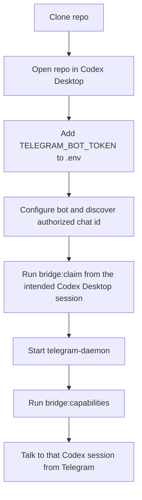

# Getting Started

This is the canonical first-run path for a brand-new user.

Goal: connect Telegram to your local OpenAI Codex Desktop session so you can keep talking to that session from anywhere.

> "Codex Desktop" here means OpenAI's coding agent app — not the deprecated 2021 OpenAI Codex model. If you do not have it installed, get it before continuing.

Start with the base bridge. It is the main supported path. Live `/call` remains a second-stage feature.

For the base bridge, the only required secret is `TELEGRAM_BOT_TOKEN`.

## Prerequisites

- Node 22+
- OpenAI Codex Desktop installed locally
- a Telegram account
- the repo cloned locally and opened in Codex Desktop
- `tmux` only if you want the optional terminal lane

## Setup Flow



If you want Codex Desktop to drive the setup with you, say:

```text
Help me set up the base Telegram bridge in this repo. Check what already exists and tell me the next step without asking me to paste secrets into chat.
```

## 1. Clone The Repo And Open It In Codex Desktop

```bash
git clone https://github.com/jvogan/telegram-codex-bridge.git
cd telegram-codex-bridge
```

If you have a fork, substitute its URL. Open that folder in Codex Desktop before you continue — Telegram should inherit the specific Codex Desktop session that is looking at this workspace.

## 2. Create A Telegram Bot

Create a bot with [BotFather](https://core.telegram.org/bots#6-botfather), then keep the bot token ready for `.env`.

## 3. Install Dependencies And Copy The Starter Files

Install dependencies first:

```bash
npm ci
```

Then copy the starter files:

```bash
cp bridge.config.example.toml bridge.config.toml
cp .env.example .env
```

## 4. Add The Base Secret

Put the bot token in `.env`:

```bash
TELEGRAM_BOT_TOKEN=...
```

Do not paste secrets into chat. Keep them in `.env` or `.env.local`.

Leave the other keys blank until you decide to enable optional media providers or live `/call`.

## 5. Configure The Bot Metadata

```bash
npm run telegram:configure
```

This pushes the public bot name, description, and slash-command metadata to Telegram.

## 6. Discover Your Private Chat ID

1. Send `/start` to the bot from Telegram.
2. Run:

```bash
npm run telegram:discover
```

By default this prints exact private-chat IDs only. Re-run with `--verbose` if you need redacted webhook-host detail or private-chat labels while troubleshooting setup.

3. Copy the matching private-chat ID into:

```toml
[telegram]
authorized_chat_id = "..."
```

## 7. Set The Workspace And Initial Mode

In `bridge.config.toml`:

- set `codex.workdir` to the repo or workspace you want Telegram and Codex to work in
- keep `bridge.mode = "shared-thread-resume"` unless you deliberately want a bridge-owned thread
- leave `bridge.codex_binary = ""` first unless Codex auto-detection fails

Codex binary resolution order is:

1. `bridge.codex_binary`
2. `CODEX_BINARY`
3. `codex` on `PATH`
4. known platform-specific defaults such as the macOS Codex app bundle

## 8. Claim The Intended Codex Desktop Session

From the exact Codex Desktop session you want Telegram to inherit:

```bash
npm run bridge:claim
```

`npm run bridge:connect` is an equivalent current-session claim flow.

## 9. Start The Daemon And Verify Readiness

```bash
npm run start:telegram
npm run bridge:capabilities
```

The base bridge is ready when the capability report shows all of these clearly:

- `TELEGRAM_BOT_TOKEN: present`
- `Authorized chat: ...`
- `Telegram daemon: running`
- `Desktop thread binding: ready` for `shared-thread-resume`

If daemon startup says Codex Desktop could not be found automatically, set `bridge.codex_binary`, export `CODEX_BINARY`, or make `codex` available on `PATH`, then start the daemon again.

Once the readiness report looks right, send a normal Telegram message to the bot. That message should now continue the bound Codex Desktop thread.

If the report does not look right, check these next:

- `npm run bridge:ctl -- status`
- `.bridge-data/telegram-daemon.log`
- [troubleshooting.md](troubleshooting.md)

## 10. Optional Extras

Add these only if you want them:

- `OPENAI_API_KEY`
  - OpenAI ASR
  - OpenAI image generation
  - live `/call`
  - create one at the [OpenAI API keys page](https://platform.openai.com/api-keys)
- `ELEVENLABS_API_KEY`
  - TTS fallback or override
- `GOOGLE_GENAI_API_KEY`
  - image fallback or override

Live `/call` also requires:

- `REALTIME_CONTROL_SECRET`
- `[realtime].enabled = true`
- `npm run start:gateway`
- `npm run bridge:ctl -- call arm`

Treat `/call` as experimental. Only enable it after the base bridge is already working end to end.

Full guide: [calling-openai-realtime.md](calling-openai-realtime.md)

The optional terminal lane is also experimental. It is disabled by default and starts as a bridge-owned read-only tmux Codex worker for explicit `/terminal` work:

```toml
[terminal_lane]
enabled = true
backend = "tmux"
profile = "public-safe"
sandbox = "read-only"
approval_policy = "never"
model = "gpt-5.5"
reasoning_effort = "low"
daemon_owned = true
```

```bash
npm run bridge:capabilities
npm run bridge:ctl -- terminal init
tmux attach -t telegram-codex-bridge-terminal
npm run bridge:ctl -- terminal status
```

It does not route normal Telegram messages until the user explicitly sends `/terminal chat on`. In chat mode, normal text/document work can use the terminal lane, while image generation, voice/ASR/TTS, live calls, web-search requests, and desktop-control requests stay on the primary bridge path. `bridge:capabilities` reports the config gates; `bridge:ctl -- terminal status` and `/terminal status` inspect the live terminal lane.

If you want stronger terminal powers, ask Codex to `unlock terminal superpowers in this repo` or run:

```bash
npm run bridge:ctl -- terminal unlock-superpowers
```

That prints the config gates for workspace-write tmux or user-owned iTerm2/Terminal.app adoption.

If you are unsure whether you need an extra key, check [faq.md](faq.md).

## If You Want Codex To Drive Setup

Open [setup-with-codex.md](setup-with-codex.md). This repo includes explicit setup instructions for Codex in [AGENTS.md](../AGENTS.md).
