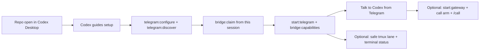

# Setup With Codex

This repo is designed so Codex Desktop can help a new user set it up without guessing.

Codex should inspect the repo state, tell you the next missing setup step, and avoid asking you to paste secrets into chat.

## What “Point Codex At The Repo” Means

For this repo, that means:

1. clone the repo locally
2. open that folder in Codex Desktop
3. ask Codex for setup help from inside that workspace
4. run `bridge:claim` from that same Codex Desktop session when you are ready for Telegram to inherit it

If you ask Codex for setup help from some other workspace, Telegram may inherit the wrong session.

## Good Starter Prompts

Use prompts like these from inside the repo:

```text
Help me set up the base Telegram bridge in this repo.
```

```text
Inspect this repo and tell me the next missing setup step without asking me to paste secrets into chat.
```

```text
Help me configure the bot and authorize my Telegram chat.
```

```text
Help me enable live /call now that the base bridge works.
```

```text
Help me troubleshoot why bridge:capabilities says something is missing.
```

```text
Help me enable the safe tmux terminal lane. Do not adopt any existing terminals.
```

```text
Help me enable the safe fallback lane for non-mutating work while my desktop Codex turn is busy.
```

```text
Unlock terminal superpowers in this repo. Explain the gates first and keep secrets out of chat.
```

## What Codex Should Do

When following this repo’s `AGENTS.md`, Codex should:

1. check whether `.env` and `bridge.config.toml` exist
2. tell you to copy the example files if they do not
3. tell you which `.env` keys are required for the feature you want
4. use `telegram:discover` to help you obtain `telegram.authorized_chat_id`
5. tell you to run `bridge:claim` or `bridge:connect` only from the exact Codex Desktop session you want Telegram to inherit
6. use `bridge:capabilities` as the authoritative readiness report
7. treat live `/call` as optional second-stage setup
8. treat the fallback lane as optional safe extra capacity for non-mutating desktop-busy work, not arbitrary repo edits
9. treat the terminal lane as optional, experimental, and config-gated; safe tmux first, `/terminal chat on` only after explicit user intent, stronger powers only after explicit config changes

For the base bridge, Codex should assume `TELEGRAM_BOT_TOKEN` is the only required secret unless the user explicitly asks for OpenAI-backed media or live `/call`.

## What Codex Should Not Do

- ask you to paste secrets into chat
- invent a Telegram chat ID
- claim a thread from the wrong Codex Desktop session
- imply `/call` is ready before the realtime prerequisites and the capability report agree
- adopt iTerm2, Terminal.app, or existing tmux panes unless `terminal_lane.allow_user_owned_sessions = true` and you explicitly asked for that
- enable terminal interrupt/clear controls unless `terminal_lane.allow_terminal_control = true` and you explicitly asked for that

## Recommended Prompt Flow

### Base bridge

```text
Help me set up the base Telegram bridge in this repo. Check which files already exist and tell me the next command or file edit.
```

### Authorize the chat

```text
I already created the bot. Help me configure it and find the correct authorized chat ID.
```

### Claim the desktop session

```text
I want Telegram to inherit this current Codex Desktop session. Help me verify I should run bridge:claim here.
```

That prompt matters because `bridge:claim` should be run from the exact Codex Desktop session Telegram is meant to inherit.

### Enable live `/call`

```text
The base bridge works. Help me enable live /call and verify the gateway, secrets, and arm step.
```

### Enable the safe fallback lane

```text
The base bridge works. Help me enable the safe fallback lane for non-mutating desktop-busy work.
```

Codex should set `bridge.fallback_lane.enabled = true`, keep `bridge.fallback_lane.allow_workspace_writes = false`, leave `bridge.fallback_lane.app_server_port` unset unless there is a conflict, and tell you to inspect with `/fallback status`. It should not describe the fallback lane as a place for arbitrary repo edits, secrets, terminal work, git operations, installs, or deploys.

### Enable the safe tmux terminal lane

```text
The base bridge works. Help me enable the safe tmux terminal lane with read-only sandboxing and never approvals.
```

Codex should check that `tmux` exists, set `terminal_lane.enabled = true`, leave user-owned sessions and terminal controls disabled, run `bridge:capabilities`, and then use `npm run bridge:ctl -- terminal init` plus `npm run bridge:ctl -- terminal status`.

If you want Telegram to use the verified lane, ask for that separately:

```text
Connect Telegram to the terminal lane for normal text and safe web-research work. Keep image, voice, call, and desktop-control requests on the primary bridge.
```

Codex should tell you to send `/terminal chat on` after the lane is verified.

### Unlock terminal superpowers

```text
I understand this is experimental. Explain the terminal superpower gates, then enable the bridge-owned workspace-write tmux lane with on-request approvals.
```

Codex should keep this explicit: workspace-write tmux uses `terminal_lane.profile = "power-user"`, `terminal_lane.sandbox = "workspace-write"`, and `terminal_lane.approval_policy = "on-request"`. User-owned iTerm2, Terminal.app, or existing panes require `terminal_lane.allow_user_owned_sessions = true`.

## Final Verification Commands

Codex should usually end setup guidance with one or more of these:

```bash
npm run telegram:discover
npm run bridge:claim
npm run start:telegram
npm run bridge:capabilities
```

If setup needs more context, Codex can suggest `npm run telegram:discover -- --verbose`, but it should start with the privacy-safer default output first.

For live `/call`:

```bash
npm run start:gateway
npm run bridge:ctl -- call arm
npm run bridge:capabilities
```

For the optional terminal lane:

```bash
npm run bridge:capabilities
npm run bridge:ctl -- terminal status
```

From Telegram, `/terminal status` should show whether terminal chat mode is on or off.

## Workflow View


