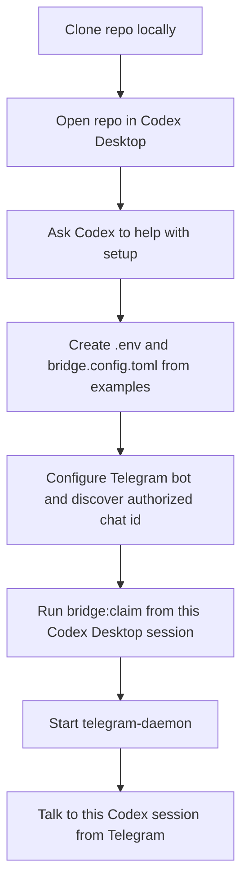
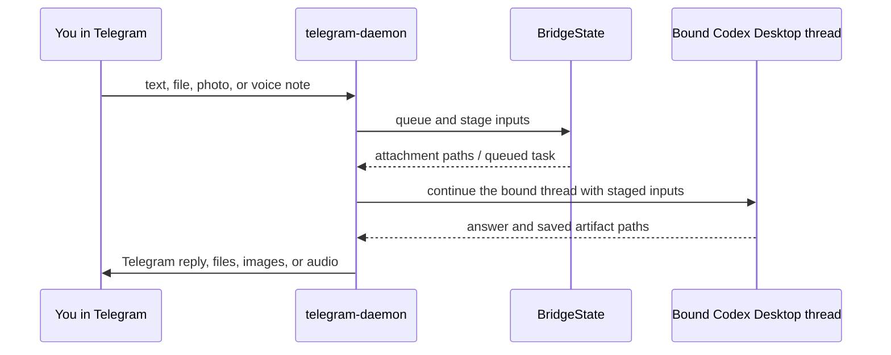
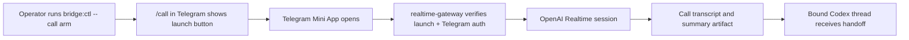
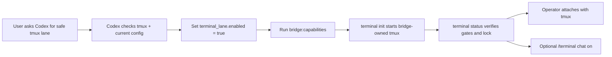

# User Workflows

This page is for a new user who wants to answer one simple question:

How do I connect this repo to a local Codex session and start talking to that session from Telegram anywhere?

Use the base bridge first. It is the main supported path. Treat live `/call` as a second-stage, experimental feature.

## Workflow 1: Clone The Repo And Point Codex At It

“Point Codex at it” means:

1. clone the repo locally
2. open that folder in Codex Desktop
3. let Codex inspect the repo from inside that workspace
4. run `bridge:claim` from the exact Codex Desktop session you want Telegram to inherit



Good first prompt inside Codex Desktop:

```text
Help me set up the base Telegram bridge in this repo. Check what already exists and tell me the next step without asking me to paste secrets into chat.
```

## Workflow 2: Talk To Codex From Telegram

After the base bridge is ready, Telegram becomes a front door into the bound Codex Desktop session you already use locally.



What this means in practice:

- if you send plain text, Telegram continues the bound Codex thread
- if you send a file or photo, the bridge stages it locally before Codex sees it
- if Codex creates a file and names the saved path clearly, the bridge can send it back to Telegram
- if you ask for audio or images, bridge-managed providers can deliver those back to Telegram too

## Workflow 3: Optional Live `/call`

Live `/call` is not required for the main product flow. It is an optional Mini App path for a live voice session when chat is too slow.



Use `/call` only after:

- the base bridge is already working
- `npm run start:gateway` is running
- `npm run bridge:capabilities` shows the realtime prerequisites are present
- `npm run bridge:ctl -- call arm` succeeds

## Workflow 4: Optional Safe Terminal Lane

The terminal lane is for explicit `/terminal` work and extra Codex capacity. Start with the safe tmux lane before considering stronger powers. Telegram uses it only after `/terminal ask ...` or `/terminal chat on`.



Safe-lane posture:

- `terminal_lane.backend = "tmux"`
- `terminal_lane.profile = "public-safe"`
- `terminal_lane.sandbox = "read-only"`
- `terminal_lane.approval_policy = "never"`
- `terminal_lane.model = "gpt-5.5"`
- `terminal_lane.reasoning_effort = "low"`
- `terminal_lane.daemon_owned = true`
- `terminal_lane.allow_user_owned_sessions = false`
- `terminal_lane.allow_terminal_control = false`

Terminal chat mode routes normal text/document work to the verified lane, but native media, image generation, live calls, web-search requests, and desktop-control requests stay on the primary bridge path.

Ask Codex for `unlock terminal superpowers in this repo` only when you deliberately want write-capable tmux or user-owned iTerm2, Terminal.app, or existing-pane adoption.

## What A New User Should Try First

The shortest successful path is:

1. clone the repo
2. open it in Codex Desktop
3. ask Codex to guide setup
4. create the bot and add `TELEGRAM_BOT_TOKEN`
5. run `npm run telegram:configure`
6. send `/start` to the bot
7. run `npm run telegram:discover`
8. set `telegram.authorized_chat_id`
9. run `npm run bridge:claim` from the intended Codex Desktop session
10. run `npm run start:telegram`
11. run `npm run bridge:capabilities`
12. send a normal Telegram message and confirm Codex replies

Once that works, then consider `/call` or the optional safe tmux lane.
